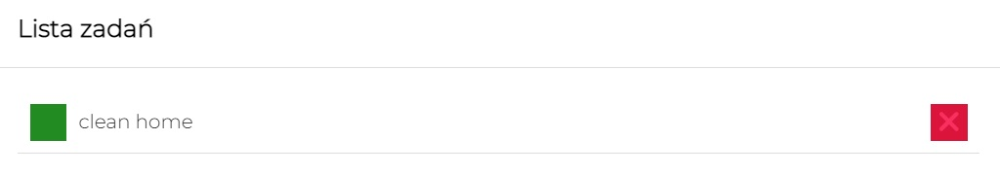
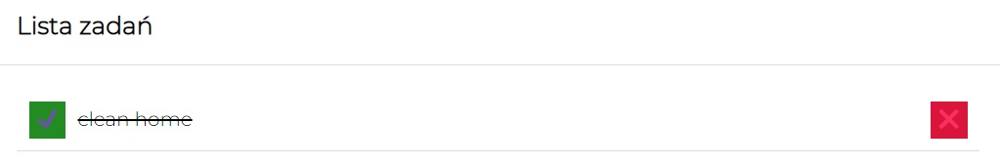

# To-do list

## You can add a new task:
- write task"s name here:

- click button "Dodaj zadanie"
- You will see new task in "Lista zadań" 

- if task is done click in the green button

- if You want dalate task click in red button

## Demo: https://switaczaleksandra.github.io/to-do-list/

