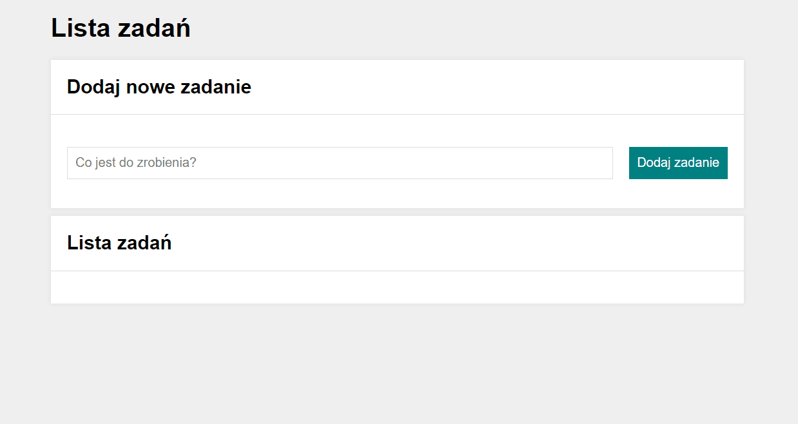

# To-do list

## You can add a new task:
- write task's name here:
- click button "Dodaj zadanie"
- You will see new task in "Lista zadań" 
- if task is done click in the green button
- if You want dalate task click in red button
- You can hide compeled tasks by clicking on the button "Ukryj ukończone" 
- You can see all compeled tasks by clicking on the button "Pokaż ukończone"
- You can fiish all tasks by clicking on the button "Ukończ wszystkie"
- 

## Demo: https://switaczaleksandra.github.io/to-do-list/

